# Nifi Ftp与HDFS使用

## 1.Windows10搭建Ftp文件服务器

为方便快捷，本案例直接使用windows自带的ftp服务

### 1.启用ftp服务

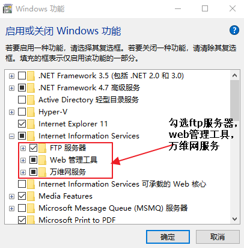

### 2.IIS管理器

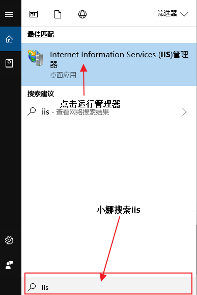

### 3.打开“IIS管理器”后，在左栏的“网站”上点击右键，打开“添加FTP站点，并配置

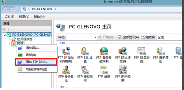

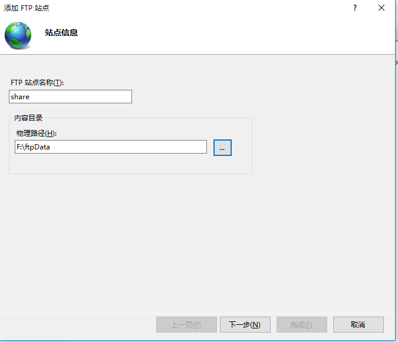

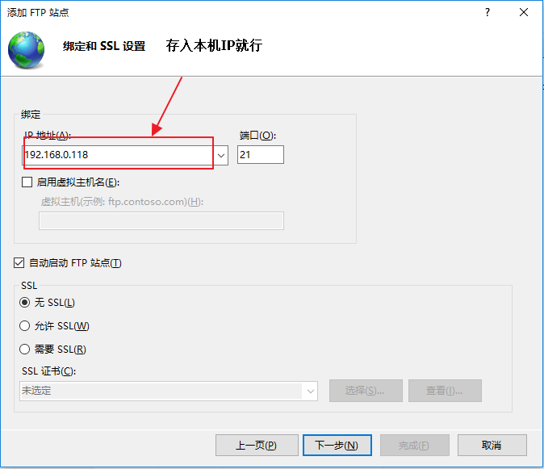

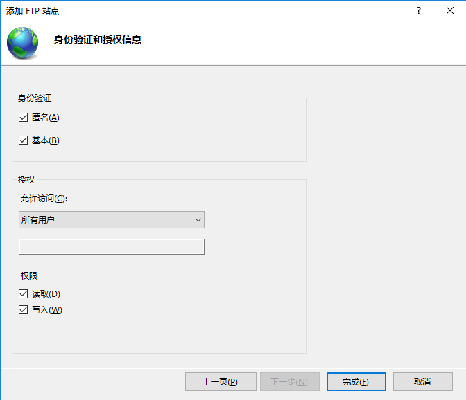

### 4.启动运行

到此Ftp服务搭建完成。

## 2.FTP与HDFS操作

为方便操作请使用模板[FtpToHDFS.xml](./FtpToHDFS.xml)

整体结构图

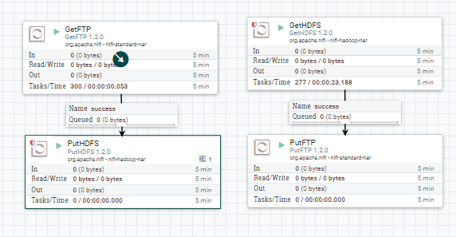

### 2.定时从ftp中拉去文件到HDFS 

#### 1.配置GetFTP

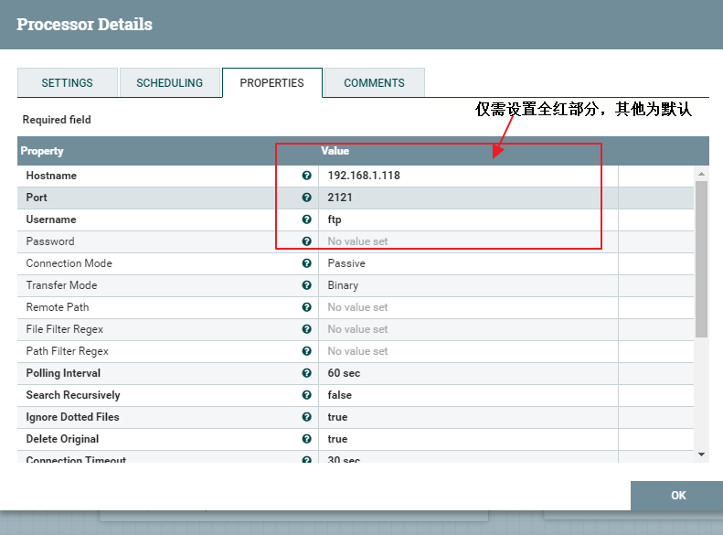

#### 2.配置PutHDFS

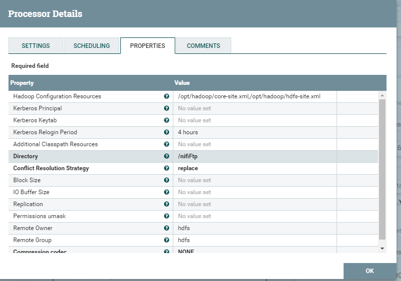

> Hadoop Configuration Resources:配置需要将hadoop集群的core-site.xml、hdfs-site.xml拷贝至nifi所在服务器的目录下。

### 3.定时从HDFS中拉取数据到ftp

#### 1.GetHDFS配置

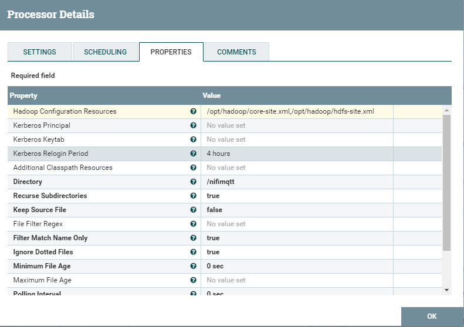

#### 2.PutFTP配置

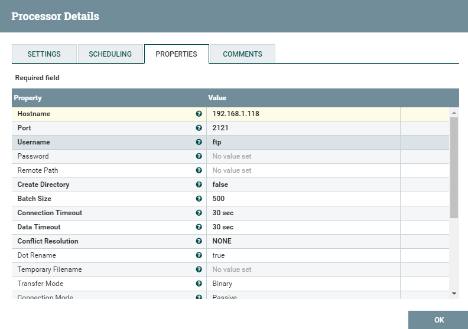

就此配置完成，启动处理器开始传输数据吧。