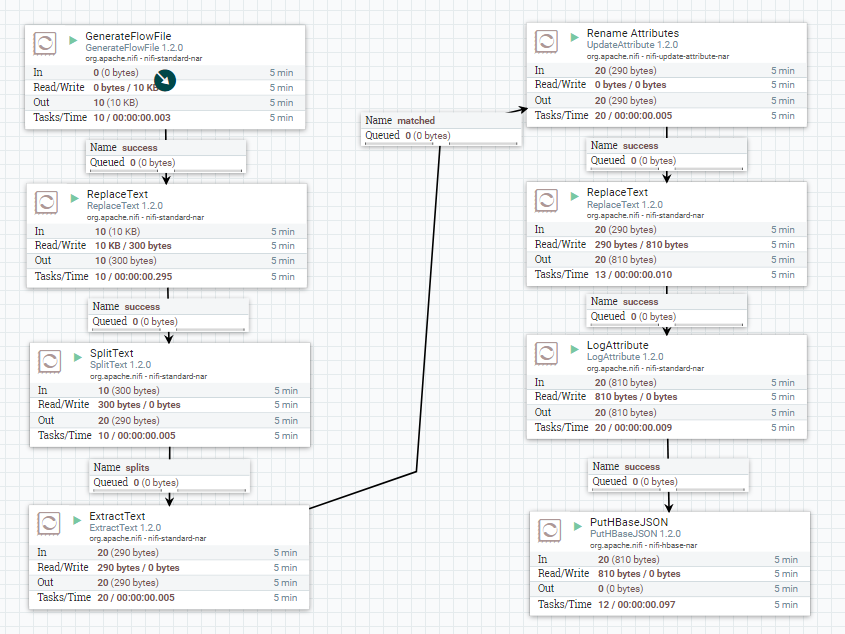
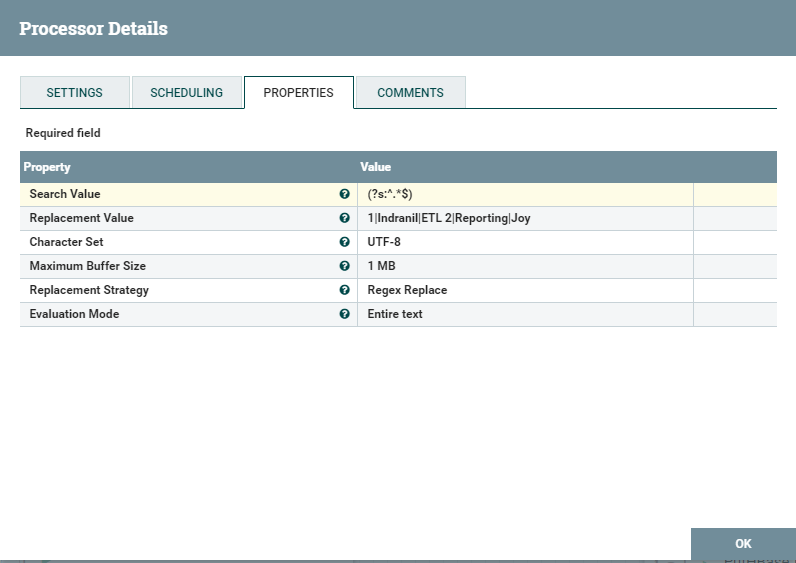
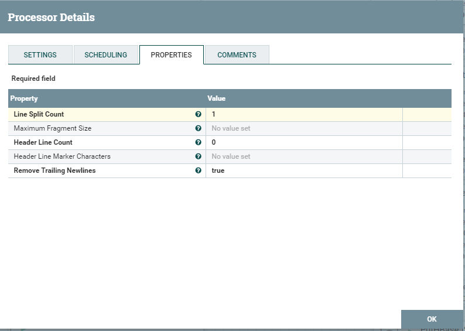
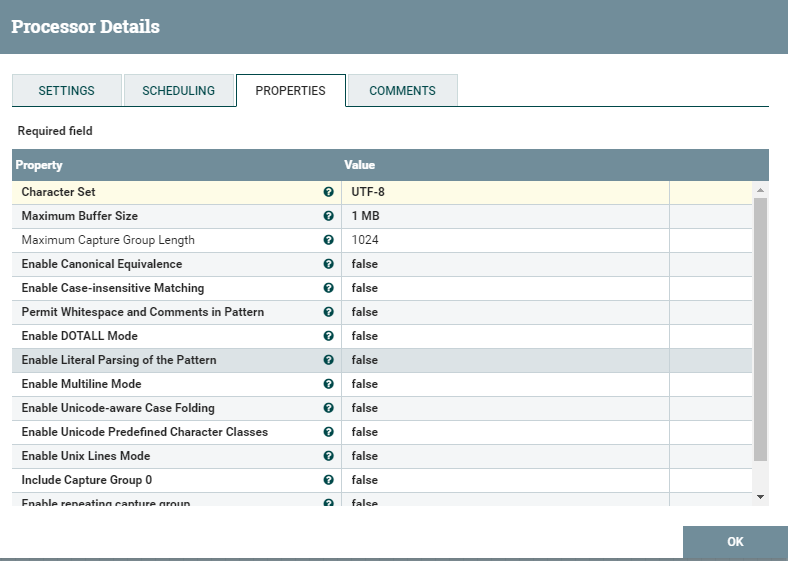
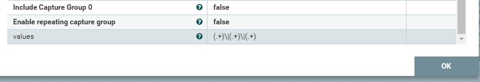
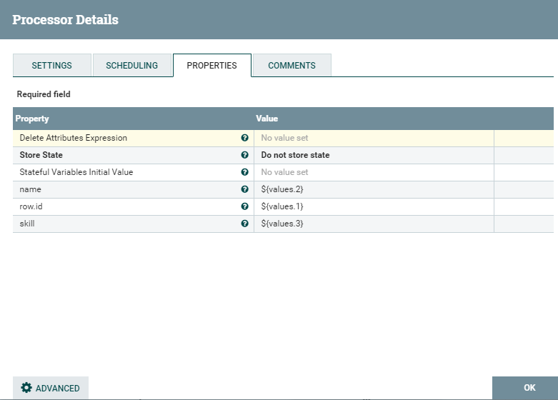
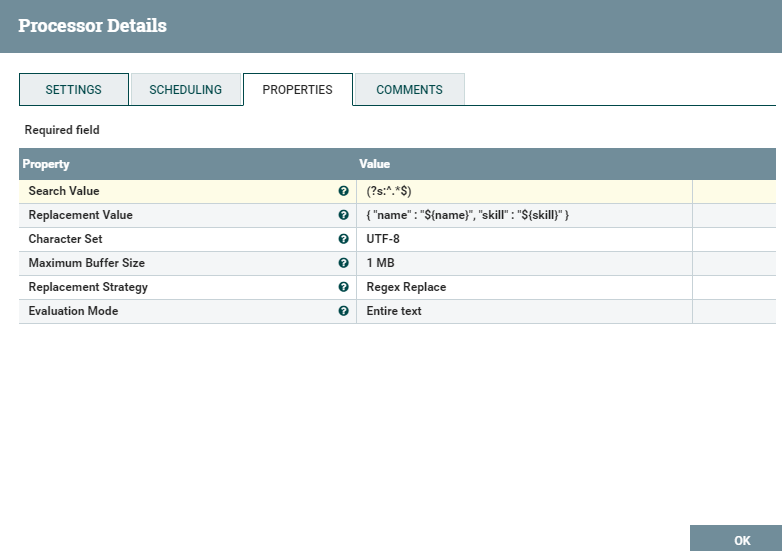
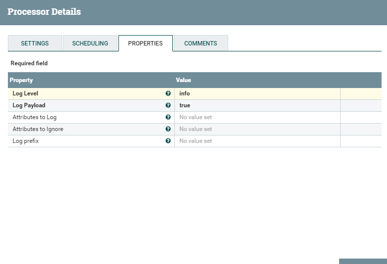
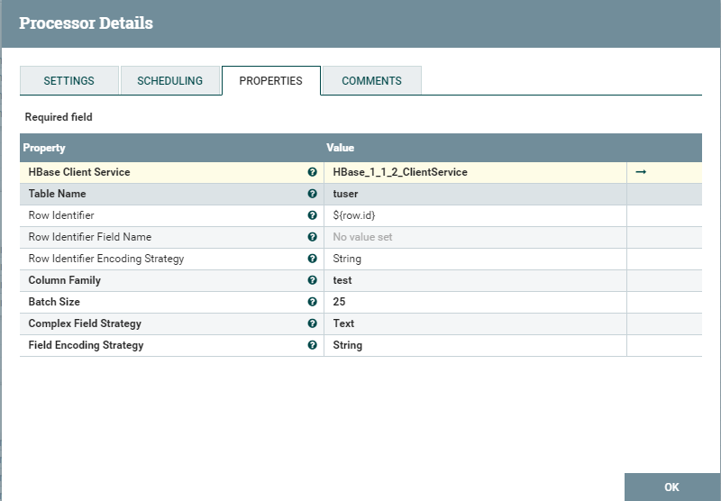
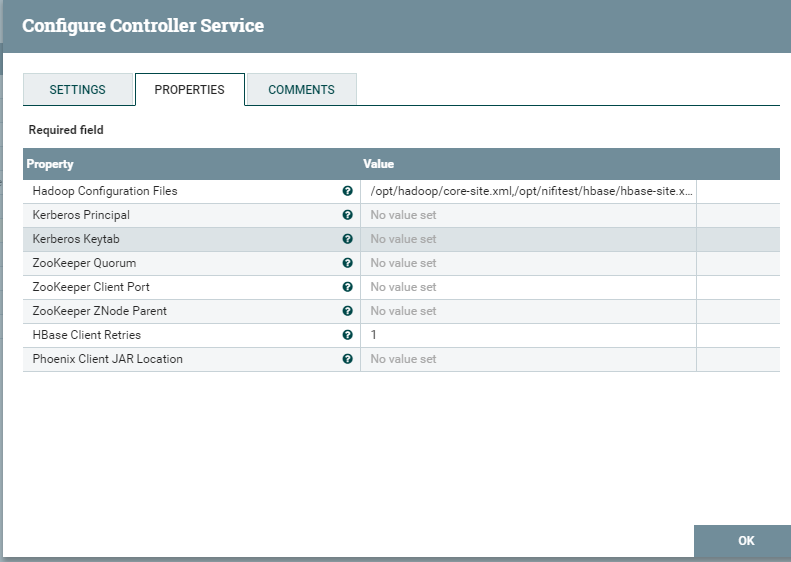

# nifi HBase Demo

为方便快速搭建，提供demo模板 [delimitedtohbase.xml](./delimitedtohbase.xml)

## 1.Demo整体结构

demo背景：利用nifi自动生成数据组件生成数据，并将数据切割清洗为json格式并传入Hbase。

## 2.ReplaceText配置

## 3. SplitText配置

## 4.ExtractText配置

## 5. Rename Attributes配置

## 6. ReplaceText配置

## 7. LogAttribute配置

## 8. PutHBaseJSON配置

HBase client配置

> 需将hadoop的core-site.xml和Hbase的hbase-site.xml复制到nifi所在机器。

