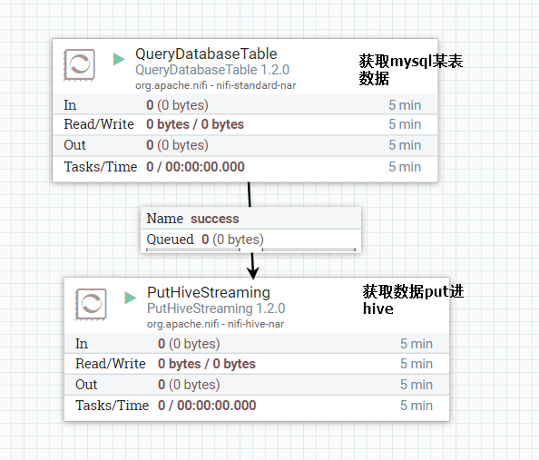
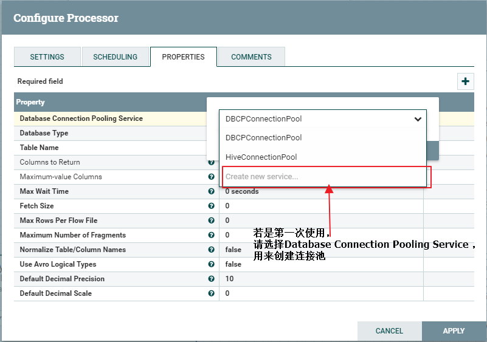
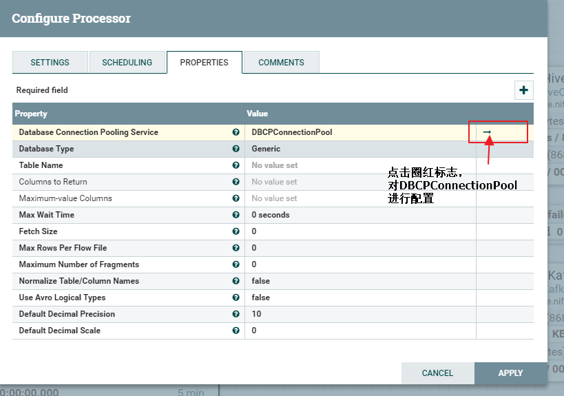
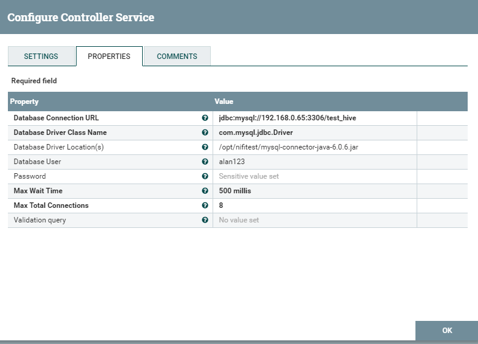
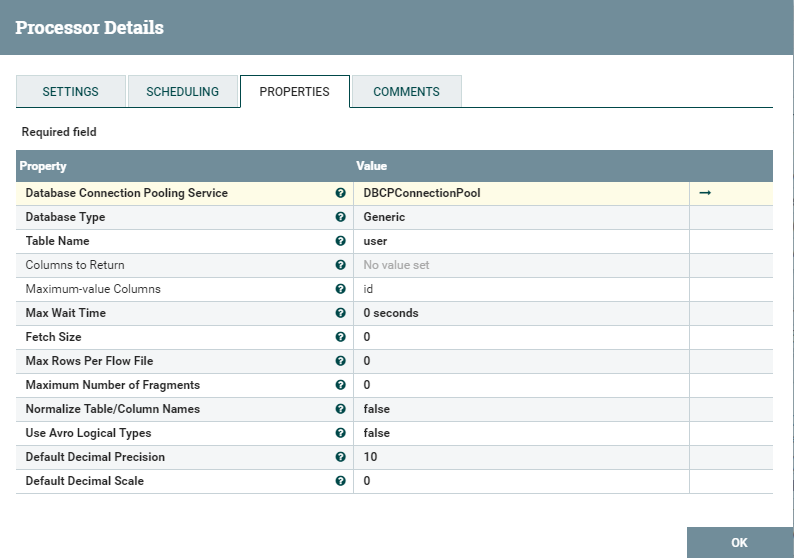
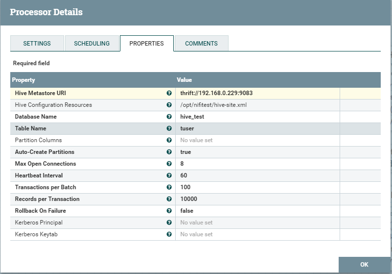
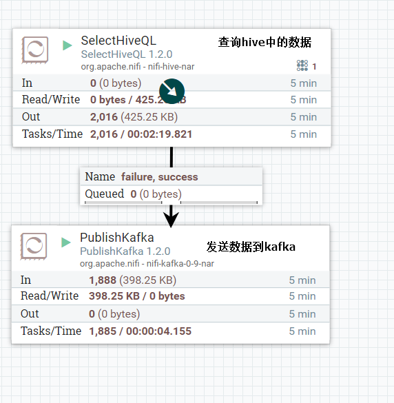
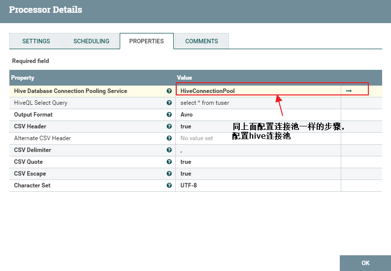
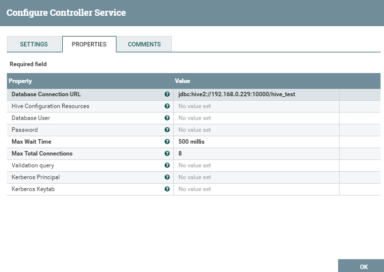
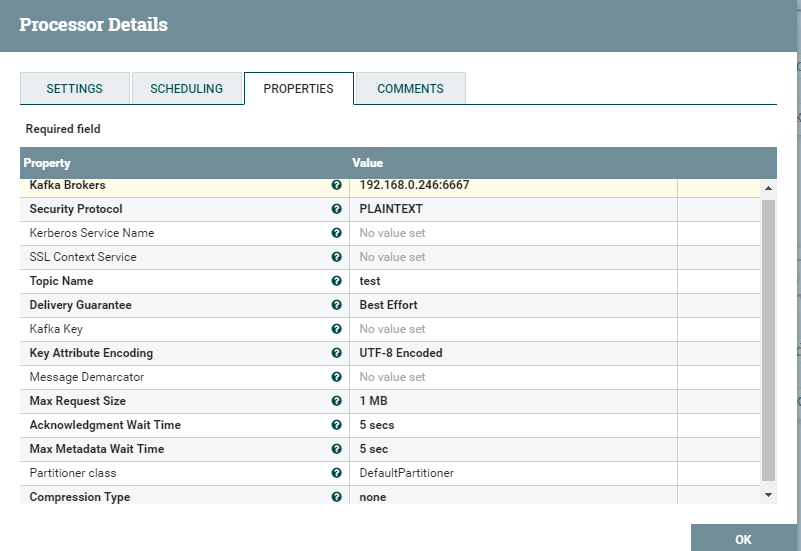

# crfHIveDemo

为方便快速搭建，提供demo模板 [hiveDemo.xml](./hiveDemo.xml)

## 1.nifi同步mysql表至hive

### 1.配置QueryDatabaseTable

若是第一次使用，请选择Database Connection Pooling Service ，
用来创建连接池,mysql选择 DBCPConnectionPool。

配置连接池

选择DBCPConnectionPool服务进行配置

配置QueryDatabaseTable剩下的配置

就此QueryDatabaseTable配置完成

### 2.配置PutHiveStreaming

## 2.nifi同步hive数据至kafka

### 1.配置SelectHiveQL

配置hive连接池

### 2.配置PublishKafka

就此整个案例配置完成，右键start运行。