# Nifi HTTP文档 

## 简介

这个案例是一个简单的实时监控存储web页面用户输入信息的示例。

## 实战

1.      引入模板（上传[NifiHTTPHelloWorld.xml](./NifiHTTPHelloWorld.xml)）

​           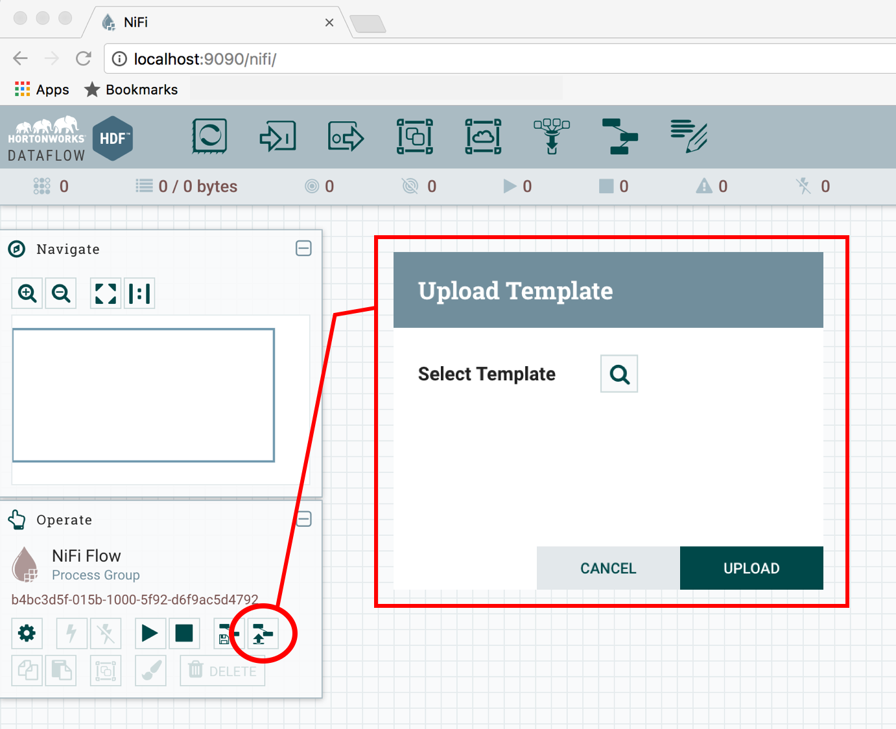                   

2.      使用模板

 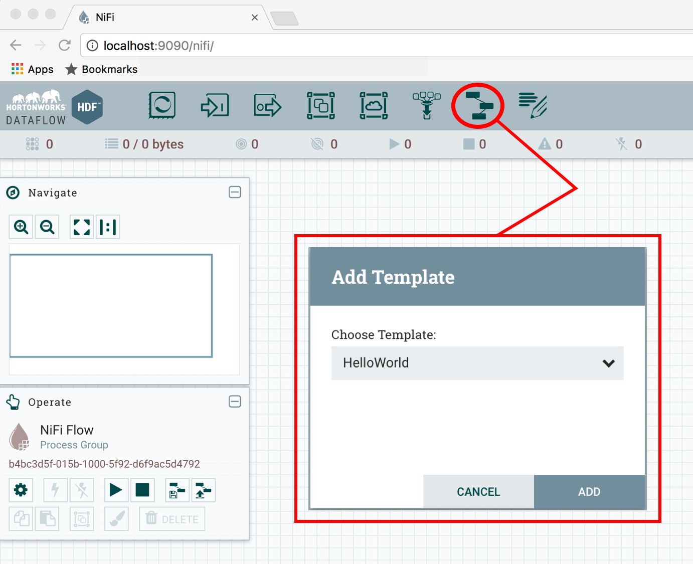

3.      HelloWorld数据流在画布上打开。我们需要更改设置，使带有黄色感叹号的处理器能够运行起来。

 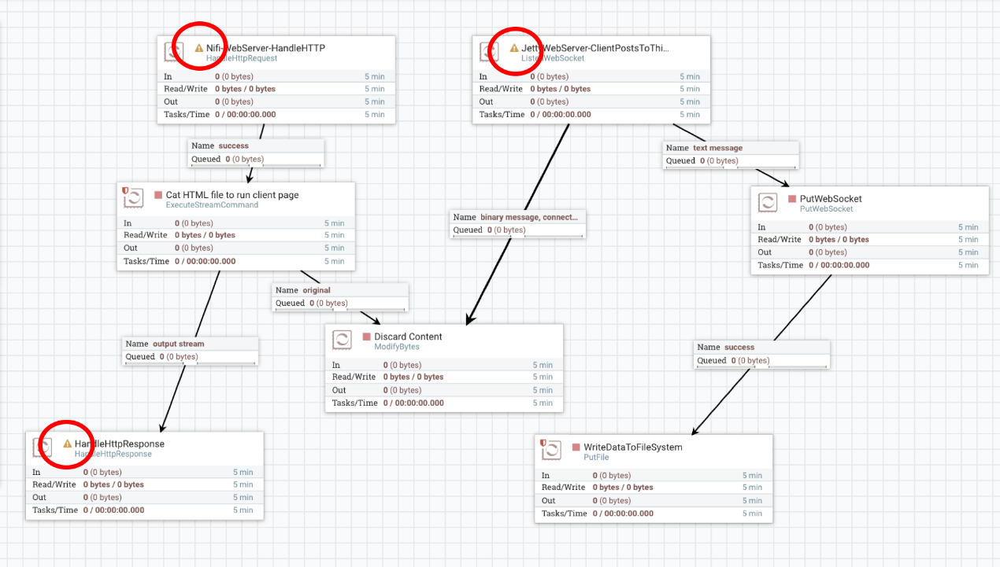

4.      配置HandleHttpRequest处理器

 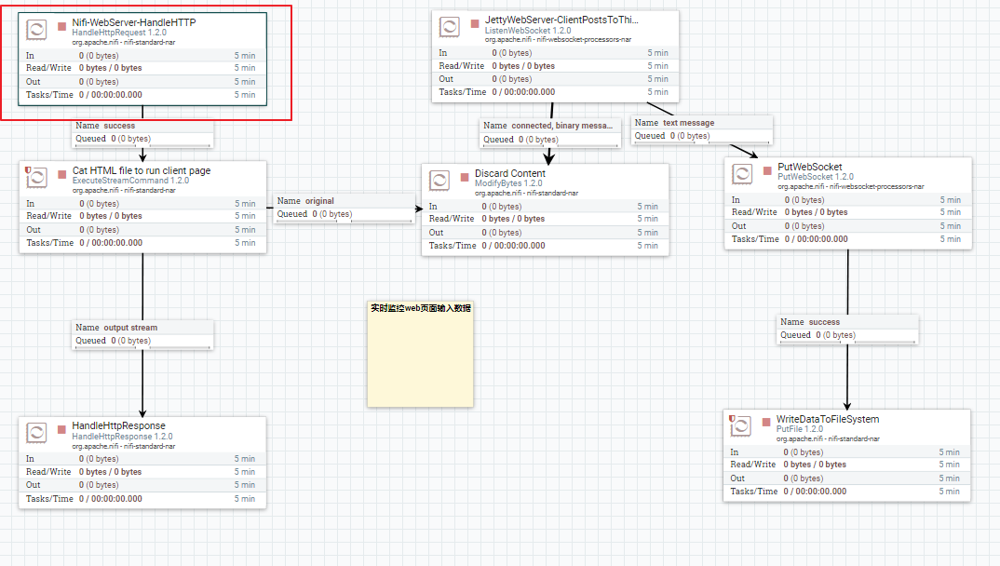

点击右键，选择configure，进入配置

 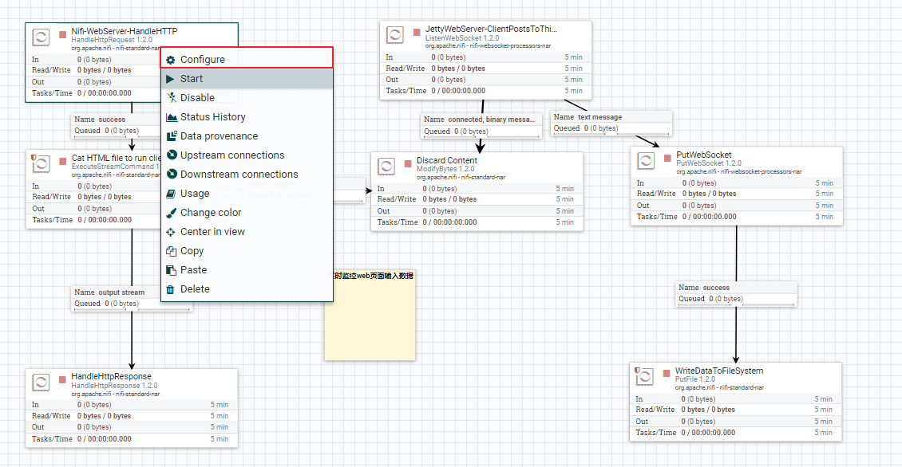

 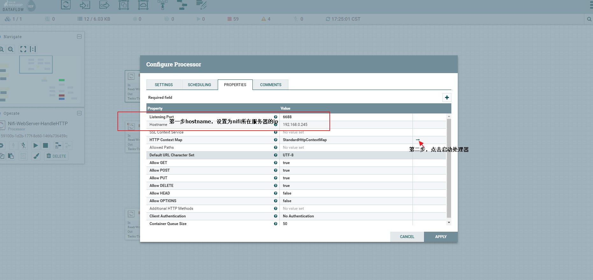

 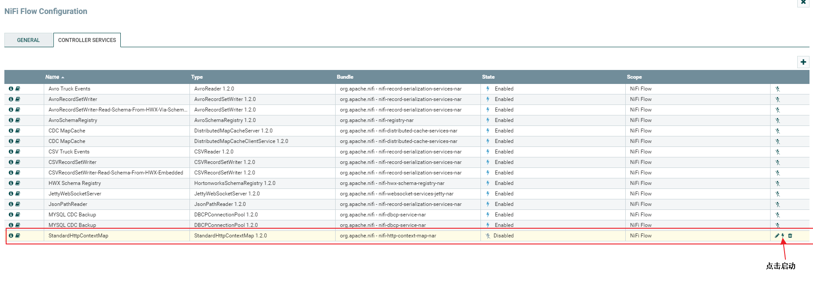

5.      上传test文件夹到服务器nifi用户目录下

 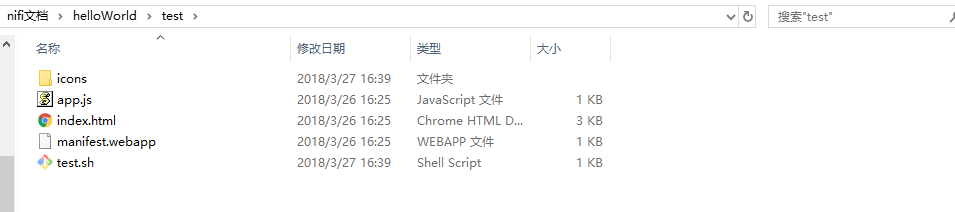

6.      更改圈红处理器配置，Command Path路径设置为test上传路径

 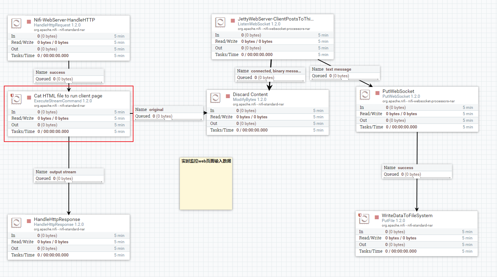

 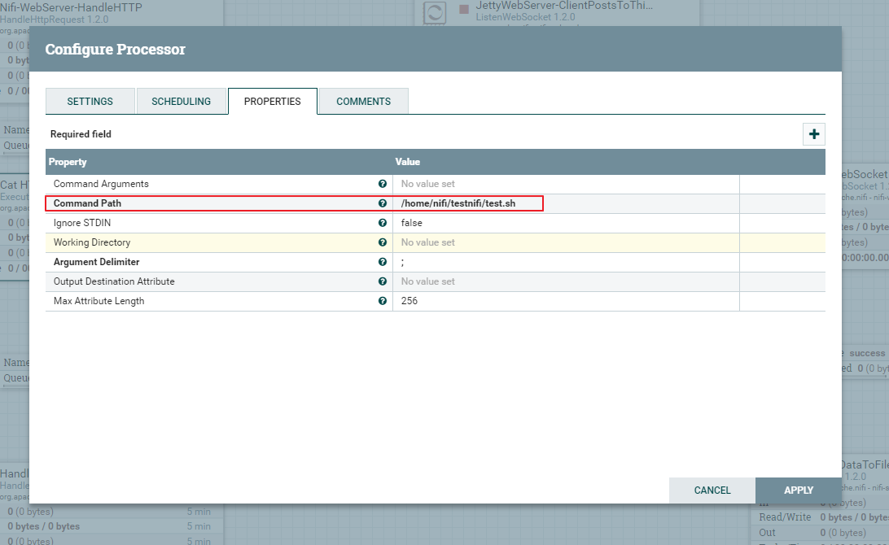

7.      设置数据输出路径（现为演示方便，直接输出到服务器目录）

 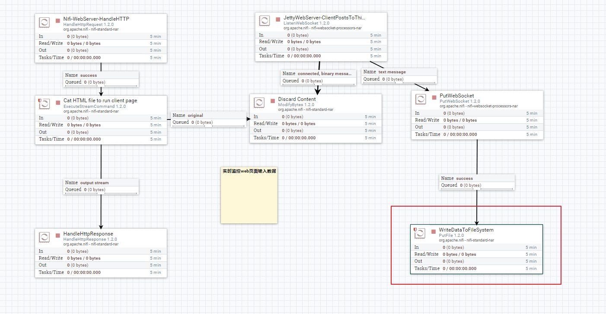

 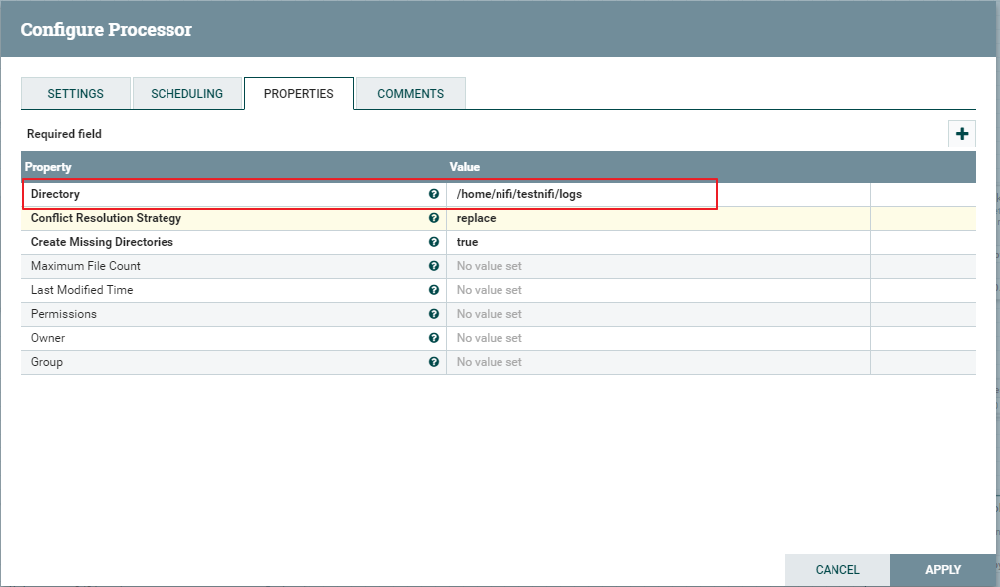

8.      启动运行（shift+鼠标左键选中）

 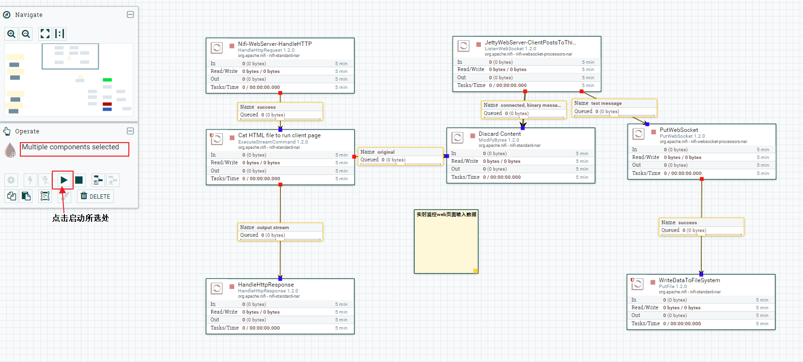

9.      打开浏览器输入之前设置的ip+端口号

 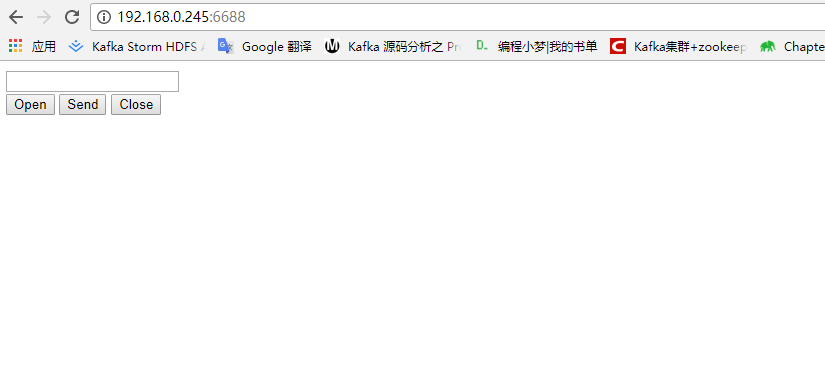

 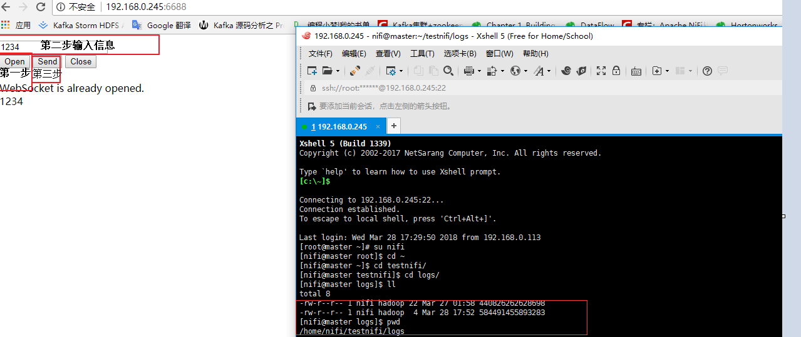