NIFI MQTT组件使用

## 前言
Apache Apollo：一个代理服务器，在ActiveMQ基础上发展而来，可以支持STOMP、AMQP、MQTT、Openwire、SSL和WebSockets等多种协议，并且Apollo提供后台管理页面，方便开发者管理和调试。
> 注意：安装使用前，请配置好jdk环境 \
注意：安装使用前，请配置好jdk环境 \
注意：安装使用前，请配置好jdk环境

## 第一步.安装配置使用mqtt
Apache Apollo支持Linux和Windows两种安装平台，在此我们选用Linux平台centos7.2安装配置。
### 1.先到官网下载
[mqtt下载地址](http://activemq.apache.org/apollo/download.html)
### 2.上传至服务器并解压
> tar -zxvf apache-apollo-1.7.1-unix-distro.tar.gz

### 3.创建代理实例
代理实例是包含与代理进程关联的所有配置和运行时数据（如日志和数据文件）的目录。建议你不是在${APOLLO_HOME}下创建实例目录。官方鼓励这种分离，以便在发布下一个版本的Apollo时可以更轻松地进行升级。

在Unix系统中，将这种运行时数据存储在/var/lib目录下是一种常见惯例。例如，要在'/ var / lib / testbroker'创建一个实例，请运行：
> cd /var/lib \
${APOLLO_HOME}/bin/apollo create testbroker

代理实例目录包含以下子目录：
- bin：保存与此实例关联的执行脚本。
- etc：保存实例配置文件
- data：保存用于存储持久性消息的数据文件
- log：保存旋转的日志文件
- tmp：保存在代理运行之间安全删除的临时文件

### 4.修改代理实例配置，使局域网内ip均可访问
> cd /var/lib/testbroker/etc \
vim apollo.xml \

修改为圈红位置的IP
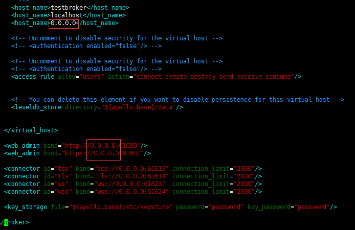

### 5.启动代理实例
> /var/lib/testbroker/bin/apollo-broker run

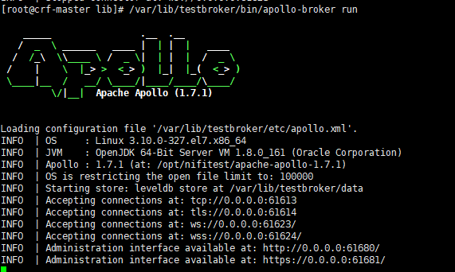
启动成功，浏览器访问(默认账号密码为:admin/password)
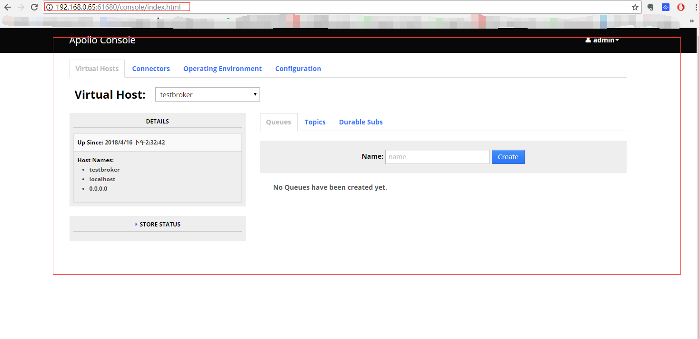

## 第二步.nifi使用mqtt

为方便使用可以直接导入 [mqttToHdfsDemo.xml](./mqttToHdfsDemo.xml)

### 1.发送数据到mqtt服务器
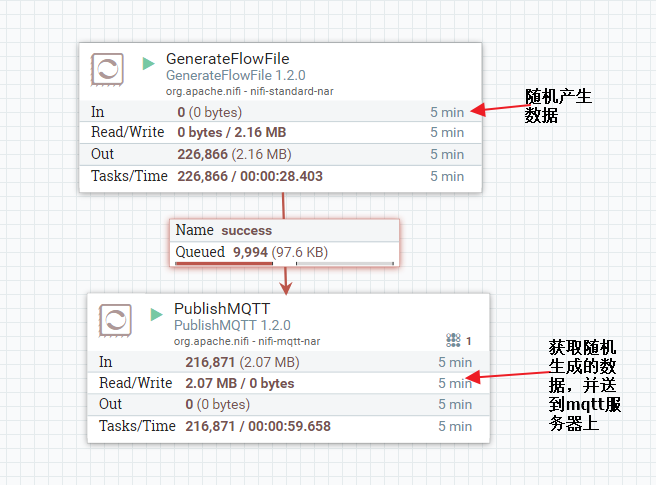
GenerateFlowFile配置（Client ID是随意输入的）
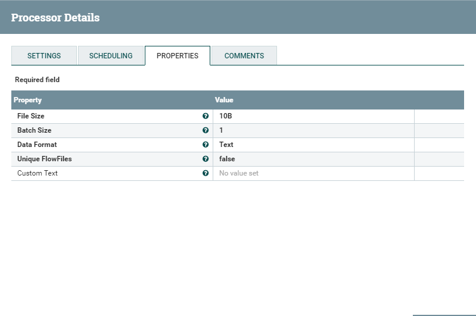
PublishMQTT配置（Client ID是随意输入的）
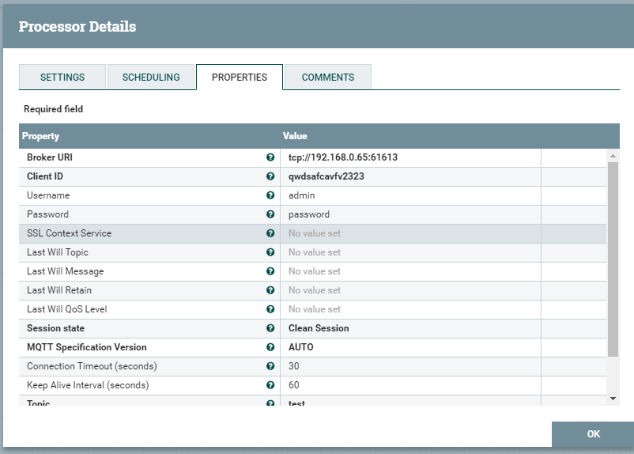
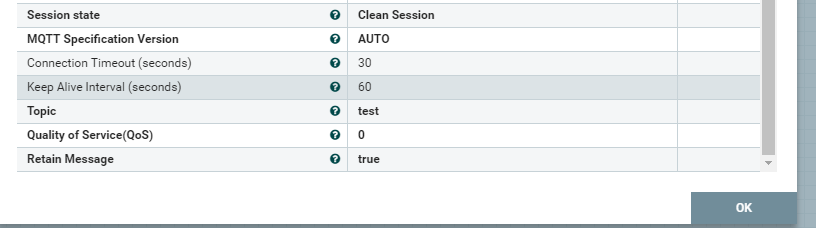
配置完成点击OK按钮进行保存。
然后启动两个控制器。

### 2.订阅mqtt服务器并发送数据至HDFS

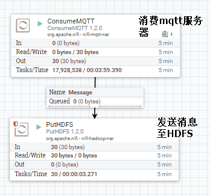

consumerMQTT配置

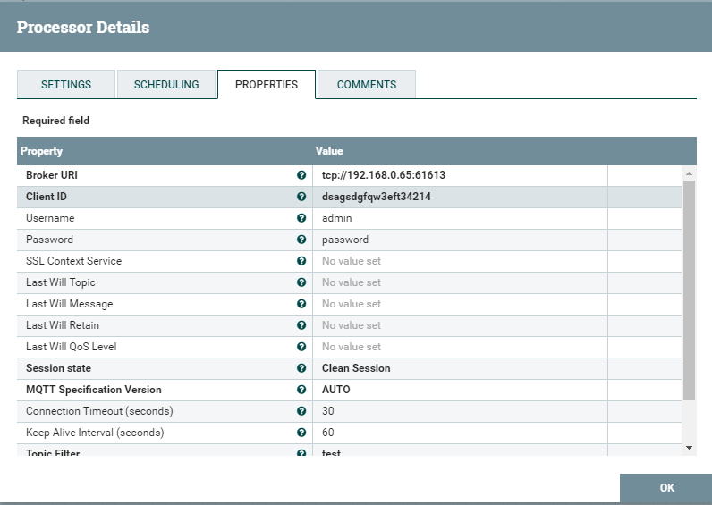

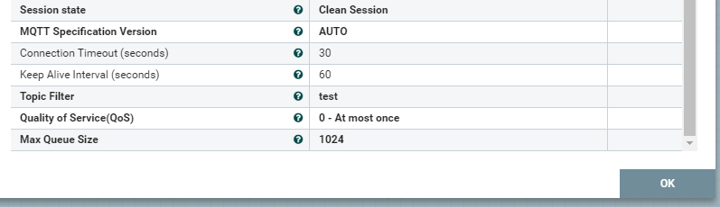

PutHDFS配置

> 注意：
>
> 1.需要将hadoop集群中的配置文件 core-site.xml、hdfs-site.xml复制到nifi所在服务器的某个目录中
>
> 2.需在hadoop集群服务器上的hdfs用户组添加用户nifi
>
> ```shell
> useradd -g test phpq        //新建phpq用户并增加到test工作组
> usermod -G groupname username  //给已有的用户增加工作组
> ```

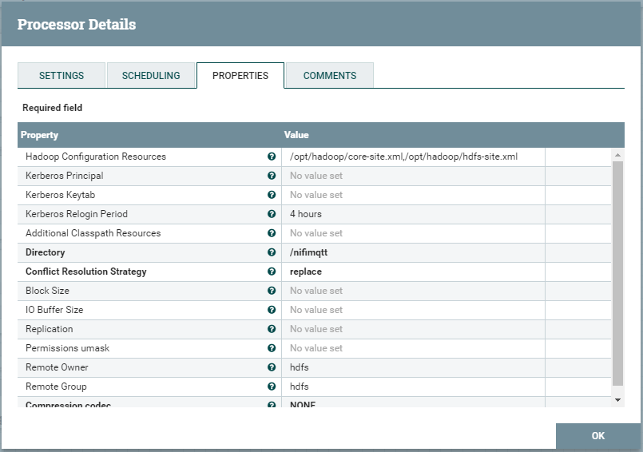

