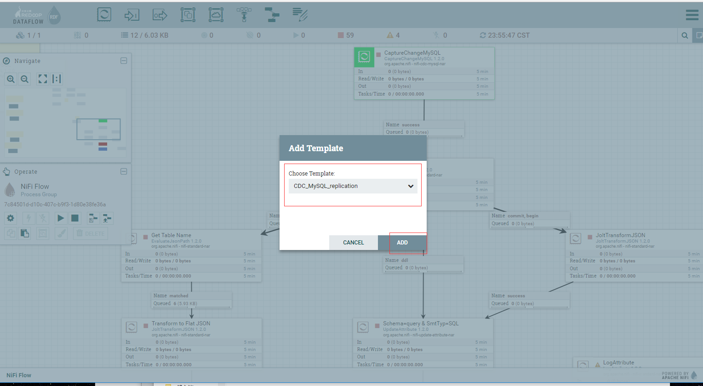
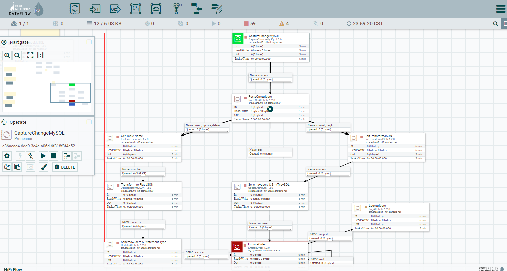
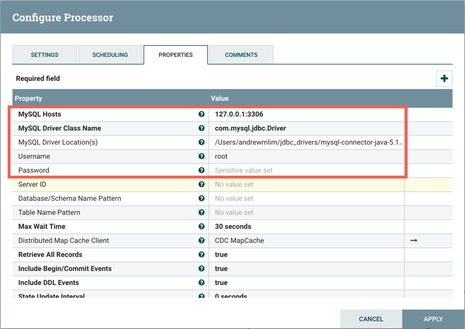
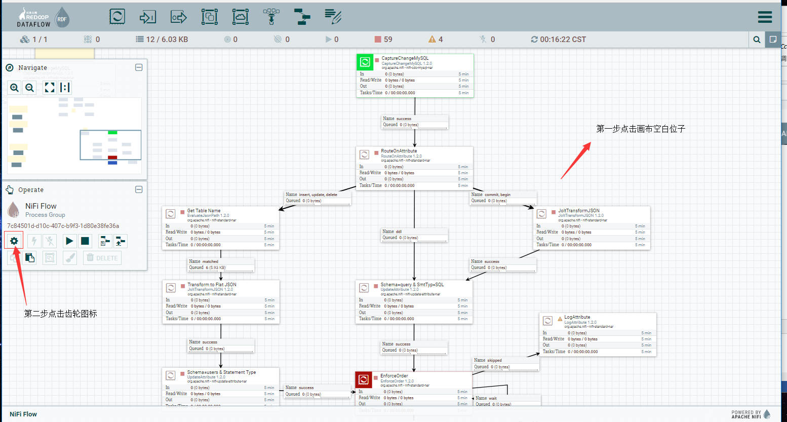
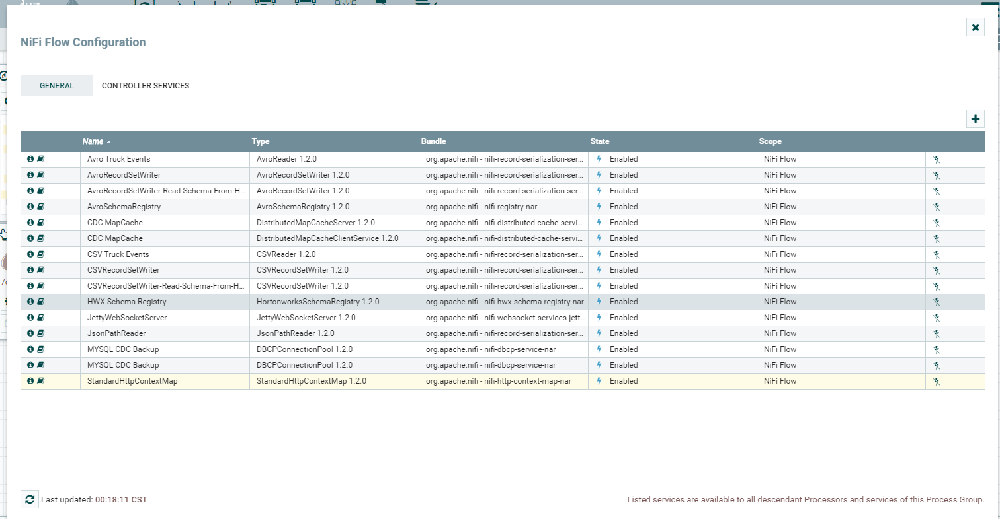
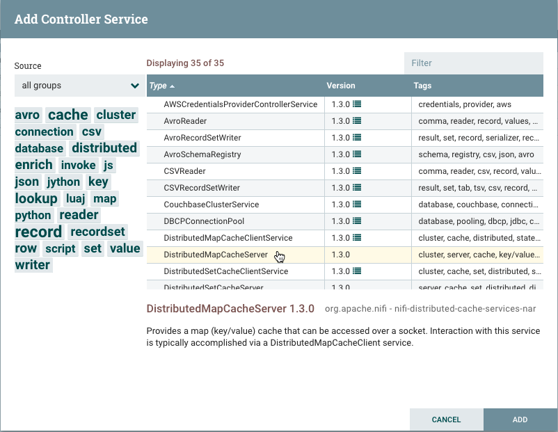
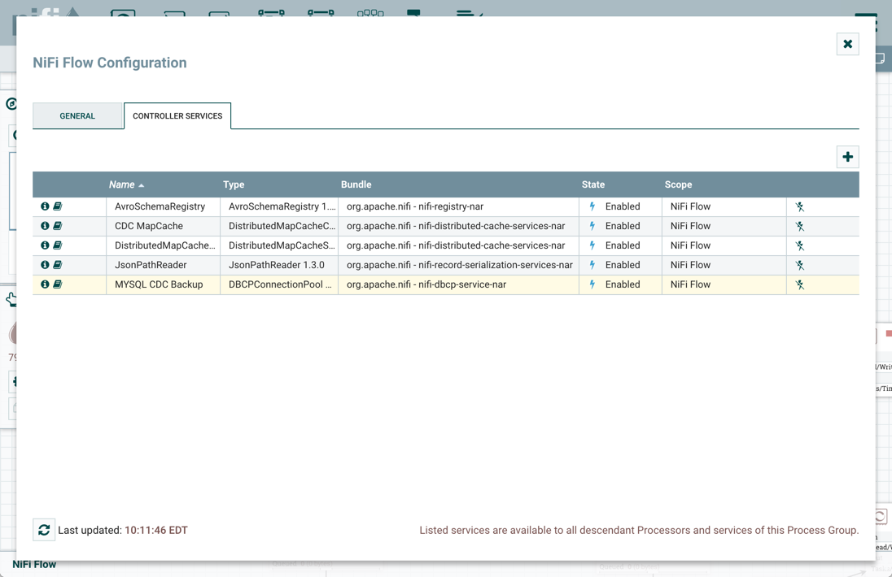
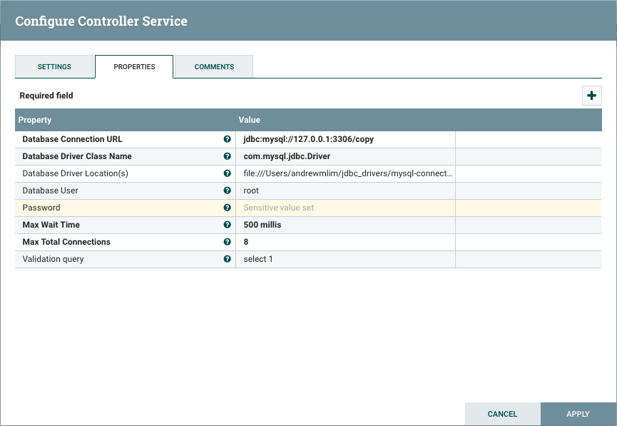
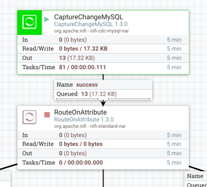

# mysqlCDC文档

### 简介：

使用ApacheNiFi中的CaptureChangeMySQL，EnforceOrder和PutDatabaseRecord处理器使用MySQL事件日志复制数据库。

### 环境要求：

​         MySQL 5.7

​    Nifi1.2或以上版本

### 基本配置

在my.cnf加入以下配置开启binarylogging

```shell
server_id= 1

log_bin= delta

binlog_format= row

binlog_do_db= source

```


创建数据库和表

```mysql
create database source;

create database copy;

```

 

```mysql
mysql>use source;

mysql>CREATETABLE users ( 

idmediumint(9) NOT NULL AUTO_INCREMENT PRIMARY KEY, 

titletext, 

firsttext, 

lasttext, 

streettext, 

citytext, 

statetext, 

ziptext, 

gendertext, 

emailtext, 

usernametext, 

passwordtext, 

phonetext, 

celltext, 

ssntext, 

date_of_birthtimestamp NULL DEFAULT NULL, 

reg_datetimestamp NULL DEFAULT NULL, 

largetext, 

mediumtext, 

thumbnailtext, 

versiontext, 

nationalitytext) 

ENGINE=InnoDBAUTO_INCREMENT=1 DEFAULT CHARSET=latin1;

```


 

 

为user表插入数据

```mysql
INSERTINTO users (id, title, first, last, street, city, state, zip,gender, email, username, password, phone, cell, ssn,date_of_birth, reg_date, large, medium, thumbnail, version,nationality) 

VALUES(1, 'miss', 'marlene', 'shaw', '3450 w belt line rd', 'abilene', 'florida','31995', 'F', 'marlene.shaw75@example.com', 'goldenpanda70', 'naughty','(176)-908-6931', '(711)-565-2194', '800-71-1872', '1991-10-07 00:22:53','2004-01-29 16:19:10', 'http://api.randomuser.me/portraits/women/67.jpg','http://api.randomuser.me/portraits/med/women/67.jpg','http://api.randomuser.me/portraits/thumb/women/67.jpg', '0.6', 'US'), 

(2,'ms', 'letitia', 'jordan', '2974 mockingbird hill', 'irvine', 'new jersey','64361', 'F', 'letitia.jordan64@example.com', 'lazytiger614', 'aaaaa1','(860)-602-3314', '(724)-685-3472', '548-93-7031', '1977-11-14 11:58:01','2002-02-09 17:04:59', 'http://api.randomuser.me/portraits/women/19.jpg','http://api.randomuser.me/portraits/med/women/19.jpg','http://api.randomuser.me/portraits/thumb/women/19.jpg', '0.6', 'US'), 

(3,'mr', 'todd', 'graham', '5760 spring hill rd', 'garden grove', 'northcarolina', '81790', 'M', 'todd.graham39@example.com', 'purplekoala484','paintball', '(230)-874-6532', '(186)-529-4912', '362-31-5248', '2006-07-2505:48:01', '2004-12-05 11:26:34','http://api.randomuser.me/portraits/men/39.jpg','http://api.randomuser.me/portraits/med/men/39.jpg','http://api.randomuser.me/portraits/thumb/men/39.jpg', '0.6', 'US'), 

(4,'mr', 'seth', 'martinez', '4377 fincher rd', 'chandler', 'south carolina','73651', 'M', 'seth.martinez82@example.com', 'bigbutterfly149', 'navy','(122)-782-5822', '(720)-778-8541', '200-80-9087', '1981-02-28 08:22:49','2009-08-31 12:42:57', 'http://api.randomuser.me/portraits/men/96.jpg','http://api.randomuser.me/portraits/med/men/96.jpg','http://api.randomuser.me/portraits/thumb/men/96.jpg', '0.6', 'US'), 

(5,'mr', 'guy', 'mckinney', '4524 hogan st', 'iowa park', 'ohio', '24140', 'M','guy.mckinney53@example.com', 'blueduck623', 'office', '(309)-556-7859','(856)-764-9146', '973-37-9077', '1983-11-03 22:02:12', '2003-10-20 07:23:06','http://api.randomuser.me/portraits/men/24.jpg','http://api.randomuser.me/portraits/med/men/24.jpg', 'http://api.randomuser.me/portraits/thumb/men/24.jpg','0.6', 'US'), 

(6,'ms', 'anna', 'smith', '5047 cackson st', 'rancho cucamonga', 'pennsylvania','56486', 'F', 'anna.smith74@example.com', 'goldenfish121', 'albion','(335)-388-7351', '(485)-150-6348', '680-20-6440', '1977-09-05 16:08:05','2008-07-11 11:09:12', 'http://api.randomuser.me/portraits/women/89.jpg','http://api.randomuser.me/portraits/med/women/89.jpg','http://api.randomuser.me/portraits/thumb/women/89.jpg', '0.6', 'US'), 

(7,'mr', 'johnny', 'johnson', '7250 bruce st', 'gresham', 'new mexico', '83973','M', 'johnny.johnson73@example.com', 'crazyduck127', 'toast', '(142)-971-3099','(991)-131-1582', '683-26-4133', '1988-08-12 14:04:27', '2001-04-30 15:32:34','http://api.randomuser.me/portraits/men/78.jpg', 'http://api.randomuser.me/portraits/med/men/78.jpg','http://api.randomuser.me/portraits/thumb/men/78.jpg', '0.6', 'US'), 

(8,'mrs', 'robin', 'white', '7882 northaven rd', 'orlando', 'connecticut','40452', 'F', 'robin.white46@example.com', 'whitetiger371', 'elizabeth','(311)-659-3812', '(689)-468-6420', '960-70-3399', '2003-07-05 13:09:41','2014-10-01 02:54:46', 'http://api.randomuser.me/portraits/women/82.jpg','http://api.randomuser.me/portraits/med/women/82.jpg','http://api.randomuser.me/portraits/thumb/women/82.jpg', '0.6', 'US'), 

(9,'miss', 'allison', 'williams', '7648 edwards rd', 'edison', 'louisiana','52040', 'F', 'allison.williams82@example.com', 'beautifulfish354', 'sanfran','(328)-592-3520', '(550)-172-4018', '164-78-8160', '1983-04-09 08:00:42','2000-01-01 07:18:54', 'http://api.randomuser.me/portraits/women/16.jpg','http://api.randomuser.me/portraits/med/women/16.jpg','http://api.randomuser.me/portraits/thumb/women/16.jpg', '0.6', 'US'), 

(10,'mrs', 'erika', 'king', '1171 depaul dr', 'addison', 'wisconsin', '50082', 'F','erika.king55@example.com', 'goldenbutterfly498', 'chill', '(635)-117-5424','(662)-110-8448', '122-71-7145', '2003-09-19 07:26:17', '2002-12-31 00:08:43','http://api.randomuser.me/portraits/women/52.jpg', 'http://api.randomuser.me/portraits/med/women/52.jpg','http://api.randomuser.me/portraits/thumb/women/52.jpg', '0.6', 'US');

```

### 开始CDC流程

#### 流程概述

以下是CDC流程的简要概述：

1. CaptureChangeMySQL读取bin日志以生成FlowFiles（JSON）


2. FlowFiles根据事件类型进行路由：

- ​      开始/提交事件：由JoltTransformJSON操纵的JSON
- ​      DDL事件：添加架构（QUERY）和语句类型（SQL）属性
- ​      删除/插入/更新事件：添加表名，模式（USERS）和语句类型属性，操纵JSON

3. EnforceOrder确保所有更改事件按正确顺序处理


4. PutDatabaseRecord使用RecordReader从输入流文件输入多条记录。这些记录被转换为SQL语句并作为一个批处理执行。

#### 流程步骤

##### 1.上传模板


##### 2.使用模板





##### 3.流程配置

###### a.选择流程中的第一个处理器CaptureChangeMySQL。右键单击并从菜单中选择“配置”。将数据库相关属性修改为刚创建的数据库地址，修改JDBC驱动程序为本机位置，并添加mysql用户密码。



###### b.点击画布空白位子，然后选着配置按钮，进入服务配置管理页面。





###### c. 单击“+”按钮并添加DistributedMapCacheServer控制器服务。不需要对默认属性做任何更改。



###### d. 选择“MySQL CDCBackup”控制器服务并选择编辑按钮（铅笔图标）。修改数据库属性以指向MySQL实例的“复制”数据库。添加JDBC驱动程序的位置和用户密码。





修改完成后点击apply进行保存。然后点击闪电标志启动5个服务。（注意：除非引用的控制器服务AvroSchemaRegistry先启用，否则无法启用JsonPathReader。）到目前画布上还有两个LogAttribute还是警告状态，它们仅作调试使用，现在先忽略它们。

e.执行CaptureChangeMySQL处理器



 

 

 

 

 

 

 